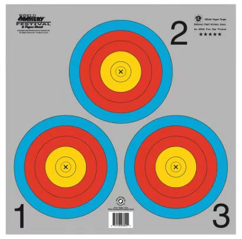
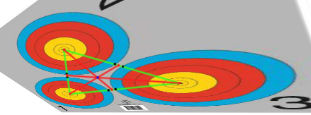

## 单张箭靶的识别与转换

本项目为箭靶等同心圆的带有透视角度的照片转换为正交图像提供了便捷的工具。运行**main. py** 以执行此任务并生成过程性图像。对于不同光照、阴影、背景环境、图像分辨率的应用场合，可能需要调整高斯模糊核大小、边缘检测阈值等参数。

## 品字形靶的识别思路与步骤

对于如图所示品字形靶的识别，首先仍应在降噪后边缘检测，生成轮廓，并进行椭圆拟合；拟合过程中保留三个相互间无交点的椭圆，如出现有交点情况则首先考虑面积大小，保留最大面积的椭圆，去除与其有交点的椭圆，如此迭代取得三个尽可能面积大，且相互无交点的椭圆，记为箭靶外轮廓。

重新进行一轮拟合，取得被外轮廓完全包含的尽可能大的椭圆各一，以此可以计算出每个箭靶的靶心所在位置。

将三个靶心两两连接，得到每条直线与椭圆圆周相交的四个交点，取其中距离最近的两点线段，在此线段上按**在两边椭圆内部线段长度的比例**取一点，与第三个靶心连接为直线。以此作出的三条直线必定交于一点，因其就是在正交图像中的等边三角形中心，经过透视变换得到的相同点。

过此点作三条射线与图像边界相交能够将图像分为三部分，同样的，三条射线也不会与任一椭圆圆周相交。将图像切割为三部分，对于每一部分单独进行识别，识别步骤同上。

这一方法由于椭圆拟合误差，图像分辨率等等情况可能有着极小概率在切割图片时切掉椭圆边缘一角，但考虑到箭命中此部分的概率极低，并且箭头本身有着一定体积，在实际情况下可以不考虑此种极端情况。

 

